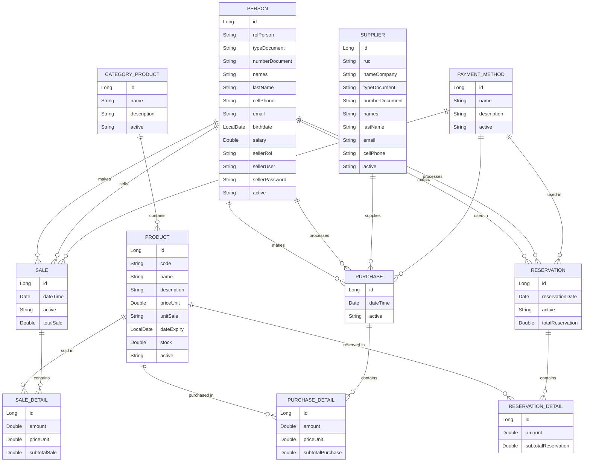

# Sistema de Ventas - SistVentas 🛒

Sistema de gestión de ventas desarrollado con Spring Boot para el backend, con conexión a base de datos Oracle y generación de reportes avanzados.

## 🎯 Descripción del Proyecto

**SistVentas** es una aplicación backend completa para la gestión de ventas que permite administrar productos, clientes, proveedores, ventas, compras y reservas. El sistema incluye funcionalidades avanzadas como generación de reportes en PDF y Excel, control de inventario y seguimiento de productos próximos a vencer.

## 🚀 Tecnologías Utilizadas

<div align="center">


</div>

### 🔧 Stack Tecnológico

- **Backend**: Spring Boot 3.2.4
- **Lenguaje**: Java 17
- **Base de Datos**: Oracle Database (ojdbc11)
- **Gestor de Dependencias**: Apache Maven
- **ORM**: Spring Data JPA
- **Documentación API**: RESTful Services
- **Generación de Reportes**: JasperReports 6.20.6
- **Manejo de Excel**: Apache POI 5.2.3
- **Reducción de Código**: Lombok
- **Pruebas**: Spring Boot Test

## 📁 Arquitectura del Proyecto

```
src/main/java/pe/edu/vallegrande/sistventas/
├── SistventasApplication.java      # Clase Principal
├── model/                          # Entidades del Dominio
│   ├── CategoryProduct.java         # Categoría de productos
│   ├── PaymentMethod.java           # Métodos de pago
│   ├── Person.java                  # Persona (cliente/vendedor)
│   ├── Product.java                 # Producto
│   ├── Supplier.java                # Proveedor
│   └── reports/                    # DTOs para reportes
│       ├── CategoryReportData.java
│       ├── ClientReportData.java
│       ├── ProductReportData.java
│       ├── SellerReportData.java
│       └── SupplierReportData.java
├── dto/                            # DTOs de negocio
│   ├── Purchase.java               # Compra
│   ├── PurchaseDetail.java         # Detalle de compra
│   ├── Reservation.java            # Reserva
│   ├── ReservationDetail.java      # Detalle de reserva
│   ├── Sale.java                   # Venta
│   ├── SaleDetail.java             # Detalle de venta
│   └── reports/                   # DTOs para reportes
├── repository/                     # Repositorios JPA
│   ├── CategoryRepo.java
│   ├── PaymentMethodRepo.java
│   ├── PersonRepo.java
│   ├── ProductRepo.java
│   ├── PurchaseDetailRepo.java
│   ├── PurchaseRepo.java
│   ├── ReservationDetailRepo.java
│   ├── ReservationRepo.java
│   ├── SaleDetailRepo.java
│   ├── SaleRepo.java
│   └── SupplierRepo.java
├── service/                        # Servicios de negocio
│   ├── CategoryService.java
│   ├── ClientService.java
│   ├── PaymentMethodService.java
│   ├── ProductService.java
│   ├── PurchaseService.java
│   ├── ReservationService.java
│   ├── SaleService.java
│   ├── SellerService.java
│   └── SupplierService.java
└── rest/                           # Controladores REST
    ├── CategoryRest.java
    ├── ClientRest.java
    ├── PaymentMethodRest.java
    ├── ProductRest.java
    ├── PurchaseRest.java
    ├── ReservationRest.java
    ├── SaleRest.java
    ├── SellerRest.java
    └── SupplierRest.java
```

## 📊 Diagrama de Entidades



## 🏗️ Modelos de Datos

### 📦 Producto (Product)
Representa los productos disponibles en el sistema de ventas.

**Atributos:**
- `id`: Identificador único (Long)
- `code`: Código único del producto (String)
- `name`: Nombre del producto (String)
- `description`: Descripción del producto (String)
- `categoryProduct`: Categoría a la que pertenece (CategoryProduct)
- `priceUnit`: Precio unitario (Double)
- `unitSale`: Unidad de venta (String)
- `dateExpiry`: Fecha de expiración (LocalDate)
- `stock`: Cantidad en inventario (Double)
- `active`: Estado del producto (String - 'A' activo, 'I' inactivo)

### 👤 Persona (Person)
Representa tanto a clientes como vendedores en el sistema.

**Atributos:**
- `id`: Identificador único (Long)
- `rolPerson`: Rol de la persona ('CLIENT' o 'SELLER') (String)
- `typeDocument`: Tipo de documento (String)
- `numberDocument`: Número de documento único (String)
- `names`: Nombres (String)
- `lastName`: Apellidos (String)
- `cellPhone`: Teléfono celular (String)
- `email`: Correo electrónico (String)
- `birthdate`: Fecha de nacimiento (LocalDate)
- `salary`: Salario (solo para vendedores) (Double)
- `sellerRol`: Rol específico del vendedor (String)
- `sellerUser`: Usuario para login (String)
- `sellerPassword`: Contraseña (String)
- `active`: Estado (String - 'A' activo, 'I' inactivo)

### 🏢 Proveedor (Supplier)
Representa a los proveedores de productos.

**Atributos:**
- `id`: Identificador único (Long)
- `ruc`: RUC de la empresa (String)
- `nameCompany`: Nombre de la empresa (String)
- `typeDocument`: Tipo de documento (String)
- `numberDocument`: Número de documento único (String)
- `names`: Nombres (String)
- `lastName`: Apellidos (String)
- `email`: Correo electrónico (String)
- `cellPhone`: Teléfono celular (String)
- `active`: Estado (String - 'A' activo, 'I' inactivo)

### 💳 Método de Pago (PaymentMethod)
Diferentes formas de pago disponibles.

**Atributos:**
- `id`: Identificador único (Long)
- `name`: Nombre del método de pago (String)
- `description`: Descripción (String)
- `active`: Estado (String - 'A' activo, 'I' inactivo)

### 🏷️ Categoría de Producto (CategoryProduct)
Clasificación de productos.

**Atributos:**
- `id`: Identificador único (Long)
- `name`: Nombre de la categoría (String)
- `description`: Descripción (String)
- `active`: Estado (String - 'A' activo, 'I' inactivo)

### 🧾 Venta (Sale)
Registro de transacciones de venta.

**Atributos:**
- `id`: Identificador único (Long)
- `client`: Cliente que realiza la compra (Person)
- `seller`: Vendedor que procesa la venta (Person)
- `paymentMethod`: Método de pago utilizado (PaymentMethod)
- `dateTime`: Fecha y hora de la venta (Date)
- `active`: Estado (String - 'A' activo, 'I' inactivo)
- `saleDetails`: Lista de detalles de la venta (List<SaleDetail>)
- `totalSale`: Total de la venta (Double)

### 📋 Detalle de Venta (SaleDetail)
Detalle de productos vendidos en una transacción.

**Atributos:**
- `id`: Identificador único (Long)
- `sale`: Venta a la que pertenece (Sale)
- `product`: Producto vendido (Product)
- `amount`: Cantidad vendida (Double)
- `subtotalSale`: Subtotal de esta línea (Double)

### 🛒 Compra (Purchase)
Registro de transacciones de compra a proveedores.

**Atributos:**
- `id`: Identificador único (Long)
- `supplier`: Proveedor (Supplier)
- `seller`: Vendedor que procesa la compra (Person)
- `paymentMethod`: Método de pago utilizado (PaymentMethod)
- `dateTime`: Fecha y hora de la compra (Date)
- `active`: Estado (String - 'A' activo, 'I' inactivo)
- `purchaseDetails`: Lista de detalles de la compra (List<PurchaseDetail>)

### 📄 Detalle de Compra (PurchaseDetail)
Detalle de productos comprados en una transacción.

**Atributos:**
- `id`: Identificador único (Long)
- `purchase`: Compra a la que pertenece (Purchase)
- `product`: Producto comprado (Product)
- `amount`: Cantidad comprada (Double)
- `priceUnit`: Precio unitario (Double)
- `subtotalPurchase`: Subtotal de esta línea (Double)

### 📝 Reserva (Reservation)
Reservas de productos por parte de clientes.

**Atributos:**
- `id`: Identificador único (Long)
- `client`: Cliente que realiza la reserva (Person)
- `seller`: Vendedor que procesa la reserva (Person)
- `paymentMethod`: Método de pago (PaymentMethod)
- `reservationDate`: Fecha de la reserva (Date)
- `active`: Estado (String - 'A' activo, 'I' inactivo)
- `reservationDetails`: Lista de detalles de la reserva (List<ReservationDetail>)
- `totalReservation`: Total de la reserva (Double)

### 📑 Detalle de Reserva (ReservationDetail)
Detalle de productos reservados.

**Atributos:**
- `id`: Identificador único (Long)
- `reservation`: Reserva a la que pertenece (Reservation)
- `product`: Producto reservado (Product)
- `amount`: Cantidad reservada (Double)
- `subtotalReservation`: Subtotal de esta línea (Double)

## 💡 Funcionalidades Principales

- ✅ Gestión completa de productos (CRUD)
- ✅ Control de inventario con alertas de stock
- ✅ Seguimiento de productos próximos a vencer
- ✅ Gestión de clientes y proveedores
- ✅ Registro de ventas, compras y reservas
- ✅ Generación de reportes en PDF y Excel
- ✅ Paginación y filtrado de datos
- ✅ Eliminación lógica y física de registros
- ✅ Validaciones y manejo de errores
- ✅ CORS configurado para integración frontend

## 🛠️ Configuración del Proyecto

### Requisitos Previos

- Java JDK 17
- Maven 3.8+
- Oracle Database (con credenciales proporcionadas)
- IDE compatible con Spring Boot (IntelliJ IDEA, Eclipse, VS Code)
```  ```

## 📊 Endpoints Principales

| Método | Endpoint | Descripción |
|--------|----------|-------------|
| GET | `/api/v1/products` | Listar todos los productos |
| POST | `/api/v1/products` | Crear nuevo producto |
| PUT | `/api/v1/products/{id}` | Actualizar producto |
| DELETE | `/api/v1/products/{id}` | Eliminar producto físicamente |
| PUT | `/api/v1/products/disable/{id}` | Desactivar producto (eliminación lógica) |
| GET | `/api/v1/products/active` | Listar productos activos |
| GET | `/api/v1/products/inactive` | Listar productos inactivos |
| GET | `/api/v1/products/expiring` | Productos próximos a vencer |
| GET | `/api/v1/products/lowstock` | Productos con bajo stock |
| GET | `/api/v1/products/report` | Generar reporte PDF de productos |
| GET | `/api/v1/products/report/excel` | Generar reporte Excel de productos |

## 📈 Generación de Reportes

El sistema cuenta con capacidad de generar reportes profesionales en:
- **Formato PDF**: Para impresión y presentación formal
- **Formato Excel**: Para análisis detallado de datos

Los reportes incluyen información completa de productos, clientes, ventas y más, con datos actualizados en tiempo real desde la base de datos.

## 🔒 Seguridad y CORS

La aplicación tiene configurado CORS para permitir solicitudes desde `http://localhost:4200`, lo que facilita la integración con aplicaciones frontend en desarrollo.

## 👥 Autores

- **Erick Portuguez**
- **Johan Malasquez**
- **Maylin Jauregui**

---
*SistVentas - Sistema de Gestión de Ventas Profesional*