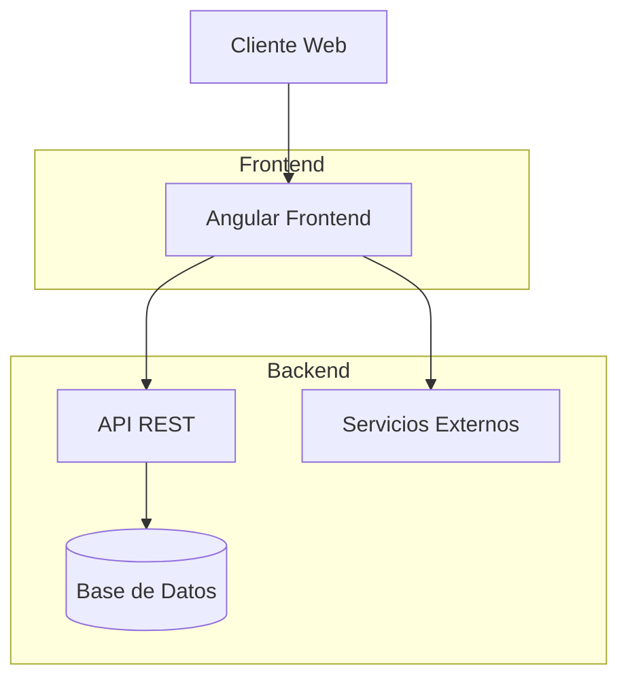
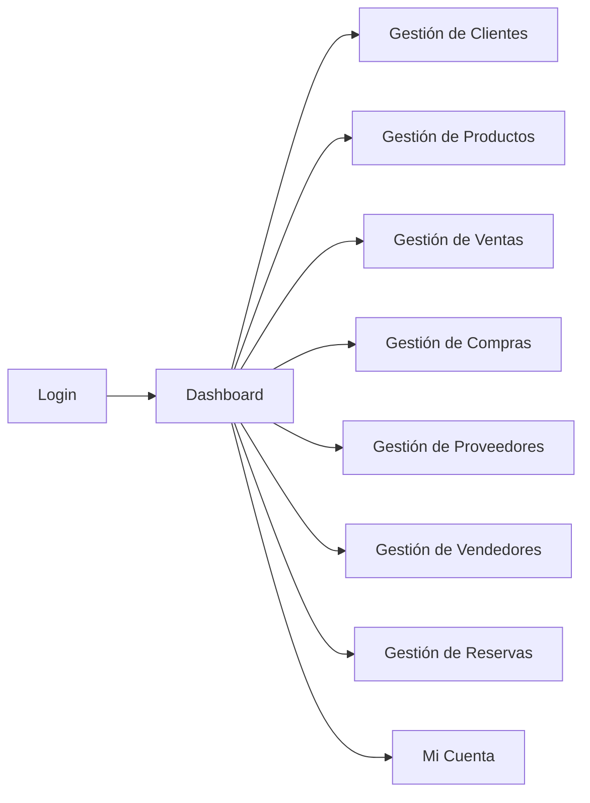

# 📊 Sisventas - Sistema de Gestión Comercial

Sistema integral de gestión comercial desarrollado con Angular para el control eficiente de operaciones empresariales.

[](https://angular.io/)
[](https://www.typescriptlang.org/)
[](https://material.angular.io/)
[](https://getbootstrap.com/)
[](https://rxjs.dev/)

---

## 📋 Índice
1. [Descripción del Proyecto](#descripción-del-proyecto)
2. [Arquitectura del Sistema](#arquitectura-del-sistema)
3. [Diagramas](#diagramas)
4. [Modelos de Datos](#modelos-de-datos)
5. [Stack Tecnológico](#stack-tecnológico)
6. [Estructura de Carpetas](#estructura-de-carpetas)
7. [Comandos Principales](#comandos-principales)
8. [Autores](#autores)

---

## 🎯 Descripción del Proyecto

**Sisventas** es una aplicación web de gestión comercial construida con Angular que permite administrar las operaciones clave de un negocio. El sistema ofrece funcionalidades completas para la gestión de:

- 🧾 **Ventas y Compras**: Registro y seguimiento de transacciones comerciales
- 👥 **Clientes y Proveedores**: Administración de contactos comerciales
- 📦 **Productos y Categorías**: Catálogo completo de inventario
- 👨‍💼 **Vendedores**: Gestión del equipo de ventas
- 📅 **Reservas**: Sistema de reservas de productos
- 👤 **Usuarios**: Control de acceso y permisos

La aplicación cuenta con un panel principal de control ([dashboard](file:///home/valerius/Escritorio/AS231S4_T12_BodegaGemma/src/app/domain/dashboard/dashboard.component.ts#L6-L35)) que proporciona métricas en tiempo real y funcionalidades de autenticación ([login](file:///home/valerius/Escritorio/AS231S4_T12_BodegaGemma/src/app/login/login.component.ts#L1-L51)) para garantizar la seguridad de la información.

---

## ⚙️ Arquitectura del Sistema

### Diagrama de Arquitectura


### Patrones de Diseño Implementados
- **Component-Based Architecture**: Organización modular por funcionalidades
- **Service Layer**: Separación de lógica de negocio y presentación
- **Reactive Programming**: Uso de Observables para manejo de datos asíncronos
- **Dependency Injection**: Inyección de dependencias nativa de Angular

---

## 📊 Diagramas

### Diagrama de Navegación


---

## 🗃️ Modelos de Datos

### Modelo de Cliente
```typescript
interface Client {
  id: number;
  names: string;
  lastNames: string;
  dni: string;
  phone: string;
  email: string;
  address: string;
  status: 'A' | 'I'; // Activo/Inactivo
}
```

### Modelo de Producto
```typescript
interface Product {
  id: number;
  name: string;
  description: string;
  price: number;
  stock: number;
  categoryId: number;
  status: 'A' | 'I';
}
```

### Modelo de Venta
```typescript
interface Sale {
  id: number;
  clientId: number;
  sellerId: number;
  date: Date;
  totalAmount: number;
  status: 'A' | 'I';
  details: SaleDetail[];
}
```

---

## 🧰 Stack Tecnológico

### 🖥️ Frontend
| Tecnología | Versión | Descripción |
|------------|---------|-------------|
|  | v17.2.0 | Framework principal de la aplicación |
|  | v5.3.2 | Superset tipado de JavaScript |
|  | v17.3.4 | Componentes UI Material Design |
|  | v5.3.3 | Framework CSS responsive |
|  | v7.8.0 | Programación reactiva |

### 📚 Librerías Adicionales
| Librería | Descripción |
|----------|-------------|
| `xlsx` | Exportación de datos a formato Excel |
| `jspdf` | Generación de documentos PDF |
| `jspdf-autotable` | Creación de tablas en PDF |
| `file-saver` | Manejo de descarga de archivos |
| `SweetAlert2` | Alertas y notificaciones visuales |

---

## 📁 Estructura de Carpetas

```
src/
├── app/
│   ├── account/                    # Gestión de cuenta de usuario
│   │   ├── account-modal/         # Modal de edición de cuenta
│   │   ├── account-password/      # Cambio de contraseña
│   │   └── account.component.ts   # Componente principal
│   ├── core/
│   │   └── services/              # Servicios compartidos
│   │       ├── client.service.ts
│   │       ├── product.service.ts
│   │       ├── category.service.ts
│   │       ├── sale.service.ts
│   │       ├── purchase.service.ts
│   │       ├── supplier.service.ts
│   │       ├── seller.service.ts
│   │       ├── reservation.service.ts
│   │       └── data.service.ts
│   ├── domain/                    # Módulos del dominio
│   │   ├── category/             # Gestión de categorías
│   │   ├── client/               # Gestión de clientes
│   │   ├── dashboard/            # Panel principal
│   │   ├── product/              # Gestión de productos
│   │   ├── purchase/             # Gestión de compras
│   │   ├── reservation/          # Gestión de reservas
│   │   ├── sale/                 # Gestión de ventas
│   │   ├── seller/               # Gestión de vendedores
│   │   └── supplier/             # Gestión de proveedores
│   ├── layout/                   # Componente de diseño principal
│   └── login/                    # Autenticación de usuarios
├── environments/                 # Configuración por entornos
└── assets/                       # Recursos estáticos
```

---

## ▶️ Comandos Principales

### 💻 Desarrollo
```bash
# Iniciar servidor de desarrollo
ng serve

# Iniciar servidor en puerto específico
ng serve --port 4200

# Generar componente
ng generate component nombre-componente

# Generar servicio
ng generate service nombre-servicio
```

### 🏗️ Construcción
```bash
# Construir para desarrollo
ng build

# Construir para producción
ng build --prod

# Construir con watch
ng build --watch
```

### 🧪 Pruebas
```bash
# Ejecutar pruebas unitarias
ng test

# Ejecutar pruebas end-to-end
ng e2e
```

---

## 👥 Autores

- **Erick Portuguez**
- **Johan Malasquez**
- **Maylin Jauregui**

---

This project was generated with [Angular CLI](https://github.com/angular/angular-cli) version 17.2.3.
